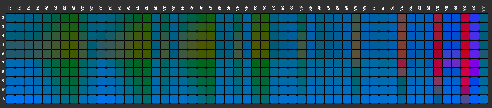

# Blackjack Simulation 
This small python3 project is an attempt at recreating the work of Edward Thorp, who in the late 50s devised what we today call blackjack basic strategy using very basic computing resources.

## Install
I used pipenv for this project, to install all necessary packages and create a virtual environment, execute:

```commandline
$ pipenv install
```

## Generate all possible hands
The first step in this simulation is to generate all possible player hands. Starting by all initial pairs: `2-2`, `2-3`, ..., `A-K`, `K-K`, and continuing with the three, four, etc. card combinations. 
In a single deck blackjack game, the hand with the largest number of cards is: `2-2-2-2-A-A-A-A-3-3`, with 10 total cards. 

The recursive code to generate all possible hands is on the `deck.py` file, execute:
        
```commandline
$ python deck.py
```

The pickled results are stored in the `results` directory, with the file name: `all_possible_hands_1_dec.pck`.

## Run simulation
Each possible hand generated on the previous step, is a valid game state in which the player has to choose between: hitting and staying. For simplicity, this simulation doesn't cover doubling nor splitting. 

`simulation.py` will loop over all hands, and simulate the results the strategies `standing` and `hitting`. Results are written in `simulation_results_standing.pck` inside the `results` directory.

## Important notes
Depending on the number of trials you want to simulate, it may end up taking quite a bit of time. If you inspect `simulation.py` you can see at the end you can plug in an AWS key and secret, if you do, the
results will be uploaded to S3. This is perfect if you run the simulation on a container inside something like Kubernetes as a Job.

## Same code in C
Python is a very high level language, certain operations like appending to a list can be computationally expensive. C is a much lower level language where our code can be further optimized
In the `C` directory of this project, you can find the C code that generates the equivalent results, except this one runs MUCH faster. 

To compile:

```commandline
cd C/cmake-build-debug
make
./blackjack_simulation_C
``` 

When the execution finishes, results will be available on the `C/results/results_one_deck.csv`. This C code assumes all possible hands are already calculated, 

## Visualizing all of this
On the `plot_results` directory, there is an angular app for a potential visualization of these results. Note that many other visualizations are possible, 
but I decided to build this one. To compile and serve:

```commandline
cd plot_results
ng serve
```  

Then browse to `localhost:4200`.

You will be presented with something like:


This chart has the starting player hands in the x-axis, and the dealers up card in the y-axis. The color of the cell represents the hitting and standing expected returns for each strategy.
When hovering over a particular a cell, a text dialog shows explicitly the aforementioned odds. I used the `Lab` color space, which is engineered to respect the human eye's non-linear behaviour, hence it more accurately represents the odds.


## Disclaimer
As it stands today, this code is very much work in progress. I expect however that it serves as a starting point for blackjack aficionados and researchers. In https://fsanmartin.co, an interactive version of the visualization is available.

